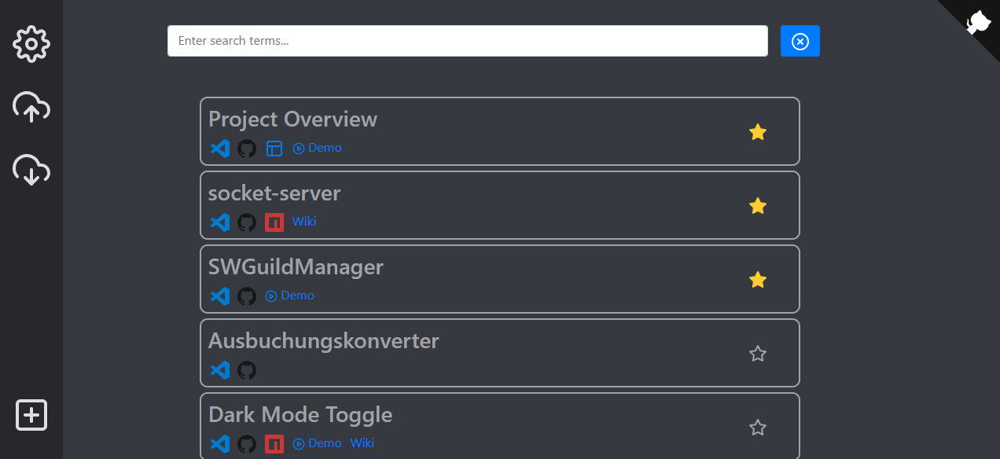

# Project Overview
Website saving links and informations to VSCode. The data is saved via localStorage.

 * [Usage](#usage)
 * [Customizations](#customizations)
 * [Libraries](#libraries)
 

## Usage
You can **add** new Projects and **update** your already added ones. The **search** looks for all phrases entered in some fields (`title`, `description` and `tags`). Since the localStorage might be cleared eventually by your browser you have the possibility to `import` and `export` your list and settings. You can also disable the **export reminder** in the settings. You can mark your **favorites** which will always land on top of the search. The **description** can handle markdown notation. By clicking on the **icons** you have quick access to your project assets.

## Customizations
You can only add new types but nbot edit and remove the default ones. Have a look at this [config](./assets/config.json) for examples.

## Libraries
 * ScrollBar [github.com/Binaryify/vue-custom-scrollbar](https://github.com/Binaryify/vue-custom-scrollbar)
 * Markdown [github.com/adapttive/vue-markdown/](https://github.com/adapttive/vue-markdown/)
 * Github Corners [github.com/YunYouJun/wc-github-corners](https://github.com/YunYouJun/wc-github-corners)
 * Generic Icons [github.com/feathericons/feather](https://github.com/feathericons/feather)
 * Corporate Icons [github.com/simple-icons/simple-icons](https://github.com/simple-icons/simple-icons)
 * Vue [vuejs.org](https://vuejs.org/)
 * Vuex [vuex.vuejs.org](https://vuex.vuejs.org/)
 * BootstrapVue [bootstrap-vue.org](https://bootstrap-vue.org/)
 * Bootstrap [getbootstrap.com](https://getbootstrap.com/)